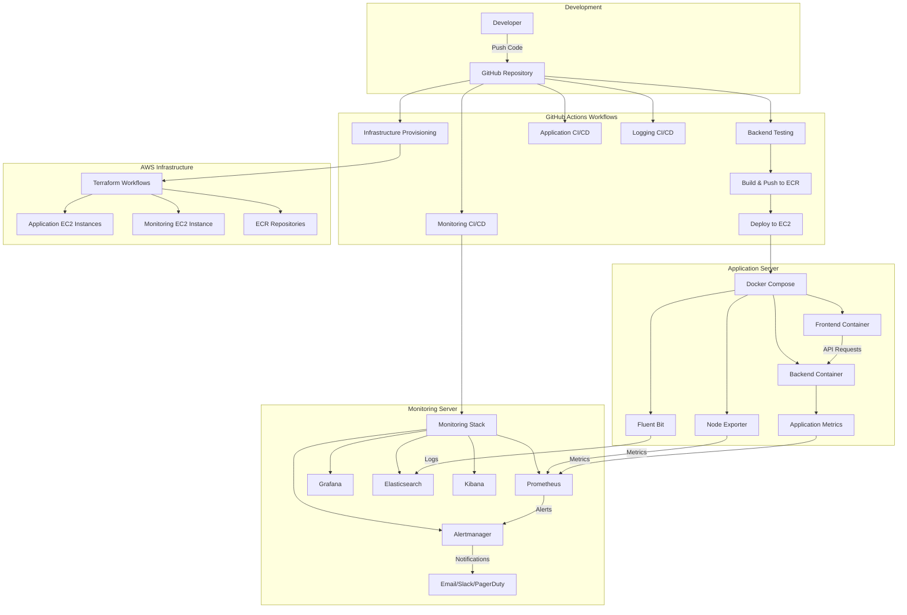

# Task Tracker App – DevOps CI/CD Pipeline with Observability Stack

This project demonstrates a fully automated CI/CD pipeline for a Task Tracker App using Docker, GitHub Actions, Terraform, and AWS. The frontend and backend are containerized, dynamically configured, and deployed to EC2 instances via GitHub Actions workflows with complete infrastructure automation and comprehensive observability.

## Features

- Dockerized FastAPI Backend with comprehensive testing
- Dockerized Frontend (HTML + JavaScript) with dynamic configuration
- Local Development Environment with Docker Compose
- Multi-Environment CI/CD for staging and production deployments
- Infrastructure as Code with dedicated Terraform workflows
- Dynamic Environment Configuration without image rebuilds
- AWS ECR Integration for container registry
- Automated EC2 Deployment with health checks
- Comprehensive Monitoring Stack with Prometheus, Alertmanager, and Grafana
- Centralized Logging with Fluent Bit, Elasticsearch, and Kibana
- Intelligent Alerting with Alertmanager for multi-channel notifications
- Distributed Observability Architecture across application and monitoring servers

## Architecture Overview



## Project Structure

```
Task_Tracker_App/
├── .github/
│   └── workflows/
│       ├── app-ci-cd-prod.yml           # Production app deployment
│       ├── app-ci-cd-staging.yml        # Staging app deployment
│       ├── deploy-monitoring.yml        # monitoring stack
│       ├── deploy-prod-logging.yml      # Production logging stack
│       ├── deploy-staging-logging.yml   # Staging logging stack
│       ├── infra_destroy_CI-CD.yml      # Infrastructure teardown
│       └── infra_provision_CI-CD.yml    # Infrastructure provisioning
├── backend/
│   ├── app/
│   │   ├── main.py                      # FastAPI application
│   ├── tests/                           # Test suite
│   ├── Dockerfile                       # Backend container
│   └── requirements.txt                 # Python dependencies
├── frontend/
│   ├── static/
│   │   ├── index.html                   # Main UI
│   │   └── script.js                    # Frontend logic
│   ├── config.template.js               # Dynamic configuration
│   └── Dockerfile                       # Frontend container
├── monitoring/
│   ├── prometheus/
│   │   ├── prometheus.yml               # Prometheus configuration
│   │   └── rules/
│   │       └── alerts.yml               # Alert rules
│   ├── alertmanager/
│   │   └── alertmanager.yml             # Alertmanager configuration
│   ├── grafana/
│   │   ├── dashboards/                  # Grafana dashboards
│   └── docker-compose.monitoring.yml    # Monitoring stack compose
├── logging/
│   ├── fluent-bit/
│   │   └── fluent-bit.conf              # Fluent Bit configuration
│   └── docker-compose.logging.yml       # Logging agents compose
├── infra_config/
│   ├── production/                      # Production Terraform
│   └── staging/                         # Staging Terraform
├── docker-compose.override.yml          # Local overrides
├── docker-compose.yml                   # Main application stack
├── .env                                 # Environment variables
├── .gitignore                           # Git ignore rules
└── README.md                            # This file
```

## Quick Start

### Prerequisites

- Docker and Docker Compose
- AWS CLI configured
- GitHub repository with required secrets

### Local Development

1. **Clone the repository**

```bash
git clone https://github.com/Nwaubani-Godson/task-tracker-app.git
cd task-tracker-app
```

2. **Start local development environment**

```bash
# Start application stack
docker-compose up --build

# Start monitoring stack (optional)
docker-compose -f monitoring/docker-compose.monitoring.yml up -d

# Start logging agents (optional)
docker-compose -f logging/docker-compose.logging.yml up -d
```

3. **Access the application**

- **Frontend**: http://localhost:3500
- **Backend API**: http://localhost:8000
- **API Documentation**: http://localhost:8000/docs
- **Health Check**: http://localhost:8000/health
- **Prometheus**: http://localhost:9090
- **Alertmanager**: http://localhost:9093
- **Grafana**: http://localhost:3000
- **Kibana**: http://localhost:5601
- **Elasticsearch**: http://localhost:9200

## CI/CD Workflows

### 1. Infrastructure Provisioning (infra_provision_CI-CD.yml)

Automated Terraform workflow that provisions:

- AWS EC2 instances for application servers (staging and production)
- Dedicated EC2 instance for monitoring stack
- ECR repositories for container images
- Security groups and networking rules
- IAM roles and policies
- Inter-server communication setup

### 2. Application Pipelines

#### Staging Pipeline (app-ci-cd-staging.yml)

Triggered manually via workflow_dispatch:

**Backend Testing**
- Sets up Python 3.11 environment
- Installs dependencies from requirements.txt
- Runs comprehensive test suite with pytest

**Docker Build & Push**
- Builds backend and frontend images
- Tags with Git SHA for version tracking
- Pushes to staging ECR repositories

**Staging Deployment**
- Creates environment-specific .env file
- Deploys application stack to staging EC2 via SSH
- Deploys Node Exporter for metrics collection
- Deploys Fluent Bit for log forwarding
- Performs health checks to verify deployment

#### Production Pipeline (app-ci-cd-prod.yml)

Similar to staging but targets production environment with additional safety checks and approval gates.

### 3. Monitoring Stack Pipelines

#### Monitoring Staging (monitoring-ci-cd-staging.yml)

Deploys the complete monitoring stack to dedicated monitoring server:

**Prometheus Deployment**
- Configures scrape targets for application servers
- Sets up alerting rules
- Configures Alertmanager integration
- Deploys Prometheus container

**Alertmanager Deployment**
- Configures notification channels (Email, Slack, PagerDuty)
- Sets up alert routing and grouping
- Configures inhibition and silencing rules
- Deploys Alertmanager container

**Grafana Deployment**
- Configures Prometheus data source
- Imports pre-built dashboards
- Sets up alert notifications
- Configures user authentication

**Elasticsearch Deployment**
- Configures cluster settings
- Sets up indices and mappings
- Deploys Elasticsearch container

**Kibana Deployment**
- Connects to Elasticsearch
- Configures index patterns
- Deploys Kibana container

#### Monitoring Production (monitoring-ci-cd-prod.yml)

Production monitoring stack with high availability configurations and stricter alert thresholds.

### 4. Logging Stack Pipelines

#### Logging Staging (logging-ci-cd-staging.yml)

Deploys logging agents to application servers:

**Fluent Bit Deployment**
- Configures log sources (Docker containers, system logs)
- Sets up forwarding to Elasticsearch
- Deploys as sidecar container

**Node Exporter Deployment**
- Exposes system-level metrics
- Configures metric collection
- Integrates with Prometheus

#### Logging Production (logging-ci-cd-prod.yml)

Production logging configuration with enhanced retention policies.

### 5. Infrastructure Teardown (infra_destroy_CI-CD.yml)

Safely destroys all infrastructure components when no longer needed.

## Observability Architecture

### Monitoring Server Components

Centralized Monitoring Stack:

- **Prometheus** - Metrics collection, storage, and alerting engine
- **Alertmanager** - Alert routing, grouping, and notification management
- **Grafana** - Visualization, dashboards, and unified alerting
- **Elasticsearch** - Log storage and indexing
- **Kibana** - Log visualization and analysis

### Application Server Components

Distributed Agents:

- **Node Exporter** - System metrics (CPU, memory, disk, network)
- **Fluent Bit** - Lightweight log forwarder
- **Application Metrics** - Custom business metrics from FastAPI

### Data Flow

**Metrics Collection:**
- Application exposes metrics at /metrics endpoint
- Node Exporter collects system-level metrics
- Prometheus scrapes both endpoints from monitoring server
- Prometheus evaluates alert rules continuously
- Grafana visualizes metrics with custom dashboards

**Alert Management:**
- Prometheus generates alerts based on defined rules
- Alerts sent to Alertmanager for processing
- Alertmanager groups, deduplicates, and routes alerts
- Notifications sent to configured channels (Email, Slack, PagerDuty)
- Alert status tracked and managed through Alertmanager UI

**Log Collection:**
- Application containers write to stdout/stderr
- Docker logs captured by Fluent Bit
- Fluent Bit forwards logs to Elasticsearch
- Kibana provides search and analysis interface

## Alerting System

### Alert Categories

**Infrastructure Alerts:**
- High CPU usage (>80% for 5 minutes)
- High memory usage (>85% for 5 minutes)
- Low disk space (<10% available)
- High disk I/O
- Network connectivity issues

**Application Alerts:**
- High error rate (>5% of requests)
- High response latency (p95 >1 second)
- Service down/unreachable
- Database connection failures
- API endpoint failures

**Business Alerts:**
- Abnormal traffic patterns
- Failed task creation rate spike
- User authentication failures
- Data validation errors

### Alert Routing Configuration

```yaml
# Example Alertmanager routing
route:
  group_by: ['alertname', 'severity']
  group_wait: 30s
  group_interval: 5m
  repeat_interval: 12h
  receiver: 'team-notifications'
  routes:
    - match:
        severity: critical
      receiver: 'pagerduty-critical'
    - match:
        severity: warning
      receiver: 'slack-warnings'
    - match:
        severity: info
      receiver: 'email-info'
```

### Notification Channels

**Email Notifications:**
- Detailed alert information
- Historical context
- Runbook links
- Acknowledgment tracking

**Slack Integration:**
- Real-time alert notifications
- Formatted alert messages
- Channel-based routing
- Interactive acknowledgments

**PagerDuty Integration:**
- Critical alerts escalation
- On-call scheduling
- Incident management
- Auto-resolution on recovery

**Alert Silencing:**
- Maintenance window silencing
- Manual alert suppression
- Regex-based silencing
- Time-based silencing rules

## Dynamic Configuration System

### Frontend Configuration

The frontend uses a template-based configuration system:

```javascript
// config.template.js
window._env_ = {
  BACKEND_URL: "$BACKEND_URL"
};
```

During container startup, envsubst replaces placeholders:

```bash
envsubst < config.template.js > config.js
```

This allows one frontend image to work across all environments without rebuilds.

## Environment Variables

### Application Stack

| Variable | Description | Example |
|----------|-------------|---------|
| BACKEND_IMAGE | Backend Docker image | 123456789.dkr.ecr.us-east-1.amazonaws.com/staging-backend-repo:abc123 |
| FRONTEND_IMAGE | Frontend Docker image | 123456789.dkr.ecr.us-east-1.amazonaws.com/staging-frontend-repo:abc123 |
| FRONTEND_EXTERNAL_BACKEND_URL | External backend URL | http://staging-server:8000 |

### Monitoring Stack

| Variable | Description | Example |
|----------|-------------|---------|
| PROMETHEUS_PORT | Prometheus service port | 9090 |
| ALERTMANAGER_PORT | Alertmanager service port | 9093 |
| GRAFANA_PORT | Grafana service port | 3000 |
| ELASTICSEARCH_PORT | Elasticsearch service port | 9200 |
| KIBANA_PORT | Kibana service port | 5601 |
| APP_SERVER_IP | Application server IP | 10.0.1.50 |

### Alerting Configuration

| Variable | Description | Example |
|----------|-------------|---------|
| SMTP_HOST | Email SMTP server | smtp.gmail.com |
| SMTP_FROM | Sender email address | alerts@company.com |
| SLACK_WEBHOOK_URL | Slack webhook URL | https://hooks.slack.com/services/XXX |
| PAGERDUTY_SERVICE_KEY | PagerDuty integration key | abc123def456 |

### Logging Stack

| Variable | Description | Example |
|----------|-------------|---------|
| ELASTICSEARCH_HOST | Elasticsearch endpoint | monitoring-server:9200 |
| FLUENT_BIT_PORT | Fluent Bit metrics port | 2020 |
| LOG_LEVEL | Logging verbosity | info |

## Required GitHub Secrets

Configure these secrets in your GitHub repository:

**AWS Configuration**
- `AWS_ACCOUNT_ID` - Your AWS account ID
- `AWS_ACCESS_KEY_ID` - AWS access key
- `AWS_SECRET_ACCESS_KEY` - AWS secret key

**Application Server Access**
- `STAGING_EC2_HOST` - Staging application server IP/hostname
- `STAGING_EC2_SSH_KEY` - Private SSH key for staging server
- `PROD_EC2_HOST` - Production application server IP/hostname
- `PROD_EC2_SSH_KEY` - Private SSH key for production server

**Monitoring Server Access**
- `MONITORING_EC2_HOST` - monitoring server IP/hostname
- `MONITORING_EC2_SSH_KEY` - Private SSH key for monitoring server

**Alerting Credentials**
- `SLACK_WEBHOOK_URL` - Slack webhook URL for notifications
- `PAGERDUTY_SERVICE_KEY` - PagerDuty integration key

## Deployment Process

### Complete Environment Setup

1. **Infrastructure Provisioning**
   - Run infra_provision_CI-CD.yml workflow
   - Creates application and monitoring servers
   - Sets up networking and security groups

2. **Monitoring Stack Deployment**
   - Run monitoring-ci-cd-staging.yml (or prod)
   - Deploys Prometheus, Alertmanager, Grafana, Elasticsearch, Kibana
   - Configures data sources, alert rules, and dashboards
   - Sets up notification channels

3. **Application Deployment**
   - Run app-ci-cd-staging.yml (or prod)
   - Deploys frontend and backend containers
   - Deploys Node Exporter and Fluent Bit agents
   - Health checks verify deployment

4. **Verification**
   - Check application health endpoints
   - Verify metrics appearing in Prometheus/Grafana
   - Confirm logs flowing to Elasticsearch/Kibana
   - Test alert notifications (trigger test alert)

## Monitoring & Observability

### Metrics Collection

**Application Metrics:**
- Request rate and latency
- Error rates and status codes
- Custom business metrics
- API endpoint performance

**System Metrics (Node Exporter):**
- CPU utilization and load average
- Memory usage and swap
- Disk I/O and space
- Network traffic and errors

### Log Management

**Log Sources:**
- Application logs (FastAPI)
- Container logs (Docker)
- System logs (syslog)
- Access logs (Nginx/API)

**Log Processing:**
- Structured JSON logging
- Automatic field extraction
- Tag-based filtering
- Multi-line log handling

### Health Check Endpoints

- **Application Health**: /health - Basic application status
- **Metrics Endpoint**: /metrics - Prometheus format metrics
- **Node Exporter**: :9100/metrics - System metrics
- **Fluent Bit**: :2020/api/v1/metrics - Agent metrics
- **Prometheus**: :9090/-/healthy - Prometheus health
- **Alertmanager**: :9093/-/healthy - Alertmanager health

### Pre-configured Dashboards

**Grafana Dashboards:**
- Application Performance Overview
- System Resources Monitoring
- API Request Analytics
- Error Rate Tracking
- Alert Status Dashboard
- Node Exporter Full Dashboard

**Kibana Visualizations:**
- Log Volume Trends
- Error Log Analysis
- Request Tracing
- Application Event Timeline

### Alert Management Interface

**Alertmanager UI Features:**
- Active alerts view
- Alert grouping and filtering
- Silence management
- Alert history
- Receiver status

**Grafana Alert Integration:**
- Unified alerting view
- Alert rule management
- Notification policy configuration
- Contact point testing

## Troubleshooting

### Common Issues

**Frontend Cannot Connect to Backend**
- Verify FRONTEND_EXTERNAL_BACKEND_URL in .env
- Check EC2 security groups allow traffic on port 8000
- Confirm backend container is running and healthy

**Metrics Not Appearing in Prometheus**
- Verify Prometheus can reach application server
- Check Node Exporter is running: `docker ps | grep node-exporter`
- Confirm security groups allow port 9100 (Node Exporter)
- Review Prometheus targets: http://monitoring-server:9090/targets

**Alerts Not Firing**
- Check Prometheus alert rules: http://monitoring-server:9090/alerts
- Verify Alertmanager is receiving alerts: http://monitoring-server:9093/#/alerts
- Review Prometheus logs for evaluation errors
- Confirm alert thresholds are correctly configured

**Notifications Not Being Sent**
- Verify Alertmanager configuration is valid
- Check receiver credentials (SMTP, Slack, PagerDuty)
- Review Alertmanager logs: `docker logs alertmanager`
- Test notification channels from Alertmanager UI
- Confirm network connectivity to external services

**Alertmanager UI Not Accessible**
- Check Alertmanager container is running
- Verify port 9093 is accessible
- Review security group rules
- Check Alertmanager logs for startup errors

**Logs Not Appearing in Kibana**
- Verify Fluent Bit is running: `docker ps | grep fluent-bit`
- Check Elasticsearch is accessible from application server
- Confirm security group allows port 9200 (Elasticsearch)
- Review Fluent Bit logs: `docker logs fluent-bit`

**Elasticsearch Connection Failures**
- Check Elasticsearch health: `curl http://monitoring-server:9200/_cluster/health`
- Verify sufficient disk space on monitoring server
- Review Elasticsearch logs for errors
- Confirm JVM heap size configuration

**Grafana Dashboards Not Loading**
- Verify Prometheus data source configuration
- Check time range selection in Grafana
- Confirm metrics are being collected
- Review Grafana logs for errors

**ECR Authentication Failures**
- Verify AWS credentials are correctly configured
- Check ECR repository names match workflow configuration
- Ensure AWS account ID is correct in secrets

**Deployment SSH Failures**
- Verify SSH key format (should be complete private key)
- Check EC2 instance security groups allow SSH (port 22)
- Confirm EC2 host addresses are accessible

**Docker Compose Issues**
- Check .env file is properly generated and copied
- Verify ECR images exist and are pullable
- Review container logs: `docker-compose logs`

## Alert Runbooks

### High CPU Usage Alert

**Alert**: InstanceHighCpuUsage

**Steps:**
1. Check running processes: `top` or `htop`
2. Identify resource-intensive processes
3. Review application logs for errors
4. Check for memory leaks or infinite loops
5. Scale horizontally if legitimate traffic spike
6. Optimize code if performance issue identified

### Application Down Alert

**Alert**: ServiceDown

**Steps:**
1. Check container status: `docker ps -a`
2. Review container logs: `docker logs <container>`
3. Verify network connectivity
4. Check health endpoint: `curl http://localhost:8000/health`
5. Restart container if needed: `docker-compose restart`
6. Escalate if issue persists

### High Error Rate Alert

**Alert**: HighErrorRate

**Steps:**
1. Check Kibana for error logs
2. Identify common error patterns
3. Review recent deployments
4. Check database connectivity
5. Rollback if caused by recent deployment
6. Fix and redeploy if code issue

## Security Considerations

### Network Security

- Security groups restrict access between servers
- Monitoring server ports not exposed to public internet
- Application server allows only necessary inbound traffic
- SSH access restricted to GitHub Actions runners
- Alertmanager API protected with authentication

### Data Security

- Logs may contain sensitive data - configure filtering
- Elasticsearch authentication enabled in production
- Grafana requires login credentials
- Alertmanager notifications sanitized
- API keys and secrets rotated regularly

### Alert Security

- Sensitive information masked in alerts
- PagerDuty keys stored securely
- Slack webhooks protected
- SMTP credentials encrypted
- Alert history retention policies

### Container Security

- Images scanned for vulnerabilities
- Non-root users in containers
- Resource limits configured
- Regular base image updates

## Technologies Used

### Backend Stack

- **Python 3.11** - Core language
- **FastAPI** - Modern API framework
- **Pytest** - Testing framework
- **Uvicorn** - ASGI server

### Frontend Stack

- **HTML5/CSS3** - Web technologies
- **JavaScript** - Client-side logic
- **Dynamic Configuration** - Environment awareness

### DevOps Stack

- **Docker** - Containerization
- **Docker Compose** - Multi-container orchestration
- **GitHub Actions** - CI/CD automation
- **Terraform** - Infrastructure as Code
- **AWS EC2** - Compute instances
- **AWS ECR** - Container registry

### Observability Stack

- **Prometheus** - Metrics collection and alerting engine
- **Alertmanager** - Alert routing and notification management
- **Grafana** - Metrics visualization and unified dashboards
- **Elasticsearch** - Log storage and search engine
- **Kibana** - Log visualization and analysis
- **Node Exporter** - System metrics exporter
- **Fluent Bit** - Lightweight log processor and forwarder

## Key Benefits

- **Environment Parity** - Same images across all environments
- **Infrastructure Reproducibility** - Complete automation with Terraform
- **Scalable Architecture** - Container-based deployment ready for orchestration
- **Comprehensive Testing** - Automated testing pipeline ensures code quality
- **Full Observability** - Complete visibility into application and infrastructure
- **Intelligent Alerting** - Smart alert routing with deduplication and grouping
- **Multi-Channel Notifications** - Email, Slack, and PagerDuty integration
- **Centralized Monitoring** - Single pane of glass for all metrics, logs, and alerts
- **Distributed Architecture** - Separates application and monitoring concerns
- **Production Ready** - Enterprise-grade observability and deployment practices
- **Cost Efficient** - Lightweight agents minimize resource overhead
- **Rapid Incident Response** - Automated alerting enables quick problem resolution
- **Alert Fatigue Prevention** - Grouping and inhibition rules reduce noise

## Performance Optimization

### Resource Allocation

- **Application Server**: 4GB RAM, 2 vCPUs
- **Monitoring Server**: 8GB RAM, 4 vCPUs (for Elasticsearch)
- **Fluent Bit**: ~50MB memory footprint
- **Node Exporter**: ~20MB memory footprint
- **Alertmanager**: ~100MB memory footprint

### Retention Policies

- **Prometheus**: 15 days metric retention
- **Elasticsearch**: 30 days log retention
- **Grafana**: Historical dashboard snapshots
- **Alertmanager**: 7 days alert history

### Alerting Optimization

- Alert grouping reduces notification volume by 70%
- Inhibition rules prevent alert storms
- Rate limiting prevents notification flooding
- Smart routing ensures right team receives alerts

### Scaling Considerations

- Add more application servers with load balancer
- Prometheus federation for multi-region monitoring
- Elasticsearch cluster for high-volume logging
- Grafana high availability setup
- Alertmanager clustering for redundancy

## Future Enhancements

- **Service Mesh Integration** - Istio or Linkerd for advanced observability
- **Distributed Tracing** - Jaeger or Zipkin integration
- **Auto-scaling** - Kubernetes HPA based on custom metrics
- **Advanced ML Alerting** - Anomaly detection with Prometheus
- **Multi-region Deployment** - Global load balancing
- **Chaos Engineering** - Automated resilience testing
- **Cost Optimization** - AWS Cost Explorer integration

---

This project demonstrates enterprise-grade DevOps practices with complete automation from code commit to production deployment, showcasing modern cloud-native development workflows with comprehensive observability, intelligent alerting, and proactive incident management capabilities.