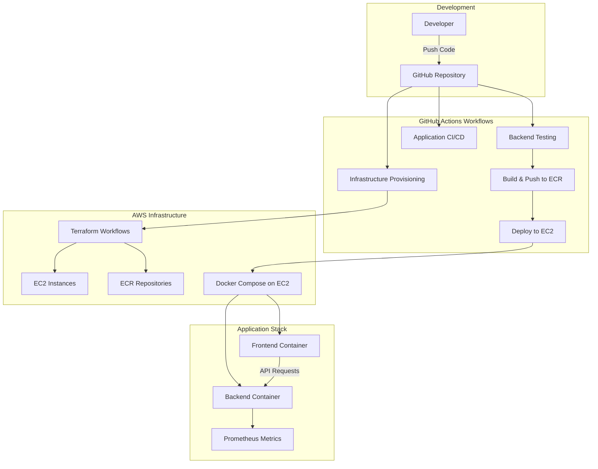

# Task Tracker App – DevOps CI/CD Pipeline

This project demonstrates a fully automated CI/CD pipeline for a **Task Tracker App** using **Docker**, **GitHub Actions**, **Terraform**, and **AWS**. The frontend and backend are containerized, dynamically configured, and deployed to EC2 instances via GitHub Actions workflows with complete infrastructure automation.

---

## Features

- **Dockerized FastAPI Backend** with comprehensive testing
- **Dockerized Frontend** (HTML + JavaScript) with dynamic configuration
- **Local Development Environment** with Docker Compose
- **Multi-Environment CI/CD** for staging and production deployments
- **Infrastructure as Code** with dedicated Terraform workflows
- **Dynamic Environment Configuration** without image rebuilds
- **AWS ECR Integration** for container registry
- **Automated EC2 Deployment** with health checks
- **Prometheus Metrics** for monitoring and observability

---

## Architecture Overview



---

## Project Structure

```
Task_Tracker_App/
├── .github/
│   └── workflows/
│       ├── app-ci-cd-prod.yml        
│       ├── app-ci-cd-staging.yml     
│       ├── infra_destroy_CI-CD.yml  
│       └── infra_provision_CI-CD.yml 
├── backend/
│   ├── app/
│   │   ├── main.py                                               
│   ├── tests/                       
│   ├── Dockerfile                   
│   └── requirements.txt             
├── frontend/
│   ├── static/
│   │   ├── index.html                            
│   │   └── script.js                
│   ├── config.template.js         
│   └── Dockerfile                
├── infra_config/
│   ├── production/                 
│   └── staging/                    
├── pytest_cache/                   
├── docker-compose.override.yml      
├── docker-compose.yml             
├── .env                           
├── .gitignore                     
└── README.md                      
```

---

## Quick Start

### Prerequisites

- Docker and Docker Compose
- AWS CLI configured
- GitHub repository with required secrets

### Local Development

1. **Clone the repository**
   ```bash
   git clone https://github.com/Nwaubani-Godson/task-tracker-app.git
   cd task-tracker-app
   ```

2. **Start local development environment**
   ```bash
   docker-compose up --build
   ```

3. **Access the application**
   - **Frontend:** http://localhost:3500
   - **Backend API:** http://localhost:8000
   - **API Documentation:** http://localhost:8000/docs
   - **Health Check:** http://localhost:8000/health

---

## CI/CD Workflows

### 1. Infrastructure Provisioning (`infra_provision_CI-CD.yml`)

Automated Terraform workflow that provisions:
- AWS EC2 instances for staging and production
- ECR repositories for container images
- Security groups and networking
- IAM roles and policies

### 2. Staging Pipeline (`app-ci-cd-staging.yml`)

Triggered manually via `workflow_dispatch`:

1. **Backend Testing**
   - Sets up Python 3.11 environment
   - Installs dependencies from `requirements.txt`
   - Runs comprehensive test suite with `pytest`

2. **Docker Build & Push**
   - Builds backend and frontend images
   - Tags with Git SHA for version tracking
   - Pushes to staging ECR repositories

3. **Staging Deployment**
   - Creates environment-specific `.env` file
   - Deploys to staging EC2 via SSH
   - Performs health checks to verify deployment

### 3. Production Pipeline (`app-ci-cd-prod.yml`)

Similar to staging but targets production environment with additional safety checks.

### 4. Infrastructure Teardown (`infra_destroy_CI-CD.yml`)

Safely destroys infrastructure when no longer needed.

---

## Dynamic Configuration System

### Frontend Configuration

The frontend uses a template-based configuration system:

```javascript
// config.template.js
window._env_ = {
  BACKEND_URL: "$BACKEND_URL"
};
```

During container startup, `envsubst` replaces placeholders:
```bash
envsubst < config.template.js > config.js
```

This allows **one frontend image** to work across all environments without rebuilds.

### Environment Variables

| Variable | Description | Example |
|----------|-------------|---------|
| `BACKEND_IMAGE` | Backend Docker image | `123456789.dkr.ecr.us-east-1.amazonaws.com/staging-backend-repo:abc123` |
| `FRONTEND_IMAGE` | Frontend Docker image | `123456789.dkr.ecr.us-east-1.amazonaws.com/staging-frontend-repo:abc123` |
| `FRONTEND_EXTERNAL_BACKEND_URL` | External backend URL | `http://staging-server:8000` |

---

## Required GitHub Secrets

Configure these secrets in your GitHub repository:

### AWS Configuration
- `AWS_ACCOUNT_ID` - Your AWS account ID
- `AWS_ACCESS_KEY_ID` - AWS access key
- `AWS_SECRET_ACCESS_KEY` - AWS secret key

### EC2 Access
- `STAGING_EC2_HOST` - Staging server IP/hostname
- `STAGING_EC2_SSH_KEY` - Private SSH key for staging server
- `PROD_EC2_HOST` - Production server IP/hostname  
- `PROD_EC2_SSH_KEY` - Private SSH key for production server

---

## Deployment Process

### Staging Deployment

1. Trigger workflow manually from GitHub Actions
2. Backend tests run automatically
3. Docker images built and pushed to ECR
4. Application deployed to staging EC2
5. Health checks verify successful deployment

### Production Deployment

Similar process but with additional approval gates and safety checks.

---

## Monitoring & Health Checks

### Backend Health Endpoints

- **Health Check:** `/health` - Basic application health
- **Metrics:** `/metrics` - Prometheus metrics endpoint

### Deployment Verification

Each deployment includes:
- Container startup verification
- Backend health check (`curl http://localhost:8000/health`)
- Service availability confirmation

---

## Troubleshooting

### Common Issues

**Frontend Cannot Connect to Backend**
- Verify `FRONTEND_EXTERNAL_BACKEND_URL` in `.env`
- Check EC2 security groups allow traffic on port 8000
- Confirm backend container is running and healthy

**ECR Authentication Failures**
- Verify AWS credentials are correctly configured
- Check ECR repository names match workflow configuration
- Ensure AWS account ID is correct in secrets

**Deployment SSH Failures**
- Verify SSH key format (should be complete private key)
- Check EC2 instance security groups allow SSH (port 22)
- Confirm EC2 host address is accessible

**Docker Compose Issues**
- Check `.env` file is properly generated and copied
- Verify ECR images exist and are pullable
- Review container logs: `docker-compose logs`

---

## Technologies Used

### Backend Stack
- **Python 3.11** - Core language
- **FastAPI** - Modern API framework
- **Pytest** - Testing framework
- **Uvicorn** - ASGI server

### Frontend Stack
- **HTML5/CSS3** - Web technologies
- **JavaScript** - Client-side logic
- **Dynamic Configuration** - Environment awareness

### DevOps Stack
- **Docker** - Containerization
- **Docker Compose** - Multi-container orchestration
- **GitHub Actions** - CI/CD automation
- **Terraform** - Infrastructure as Code
- **AWS EC2** - Compute instances
- **AWS ECR** - Container registry
- **Prometheus** - Metrics and monitoring

---

## Key Benefits

- **Environment Parity** - Same images across all environments
- **Infrastructure Reproducibility** - Complete automation with Terraform
- **Scalable Architecture** - Container-based deployment ready for orchestration
- **Comprehensive Testing** - Automated testing pipeline ensures code quality
- **Monitoring Ready** - Built-in metrics and health checking


---

This project demonstrates enterprise-grade DevOps practices with complete automation from code commit to production deployment, showcasing modern cloud-native development workflows.